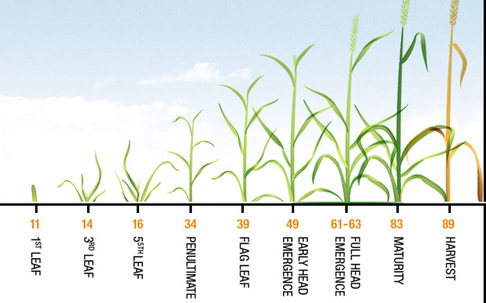
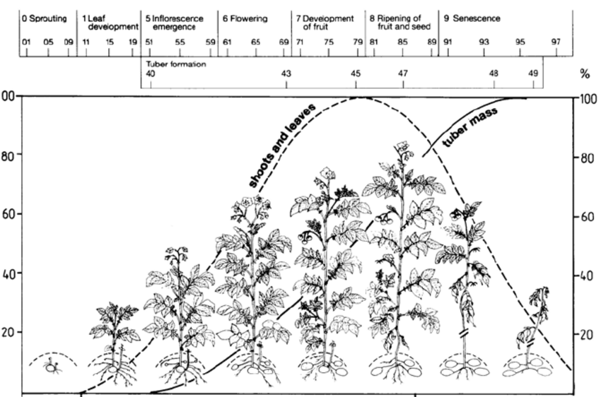
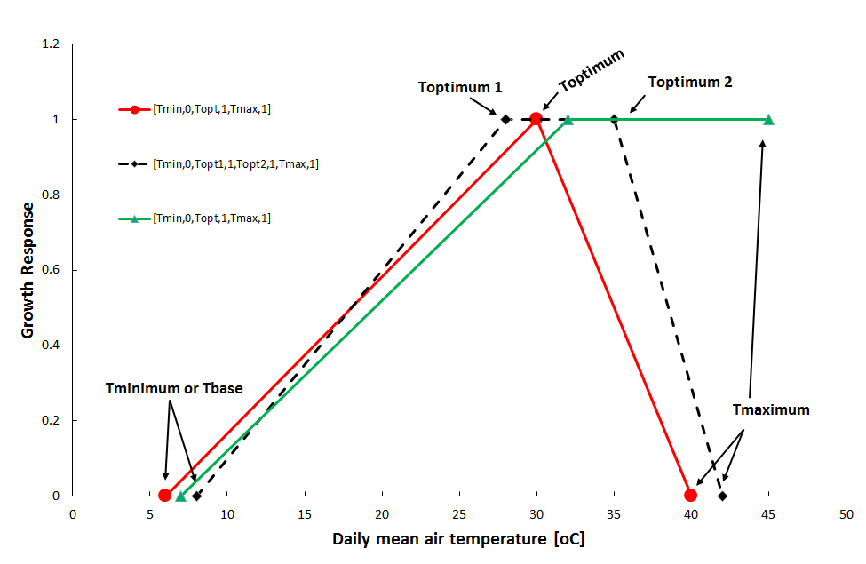

Service Components
==================

Weather Monitoring service
--------------------------

The purpose of the weather monitoring service is to provide insight into the current season weather and the weather forecast for the coming week. Based on that information, an analyst can decide on actions that farmers need to take to succesfully cultivate their fields. Such actions can be sowing, weeding, fertilizer application, irrigation, harvesting and nearly any other crop management action that is determined by the weather conditions.

For many of such advisories on crop management it is often insufficient to only know the weather forecast. It is just as important to know the conditions over the past weeks as well as an impression of how "normal" the current season is. Therefore, the weather service combines data from three different sources:

    - A weather forecast for the coming 7 days;
    - The historical weather since the start of the current season;
    - the long term average weather conditions (e.g. the 'climatology')

Based on this information charts can be generated for any location in Myanmar that put the current year weather conditions and the weather forecast into a climatological perspective. Further, the weather monitoring service also provides output for creating maps of the forecasted rainfall, temperature and wind for entire Myanmar as well as maps showing these values relative to the climatology (the so-called *z-score*). The latter can be used for alerting analysts on possible extreme conditions that could endanger the farmer and his/her crops.

Weather charts
..............

An example of a weather chart for maximum temperature is provided below. It shows the current season weather as the red line and the forecast for the coming 7 days as the red line with the circular markers. Further it also provides the maximum temperature for the previous years for this location. Often weather can only be properly understood with reference to the long term average and the extremes. Therefore the historical mean is also provide as the black line, the mean +/- one standard deviation as the dark grey areas and the minimum and maximum values recorded in the past as the light grey areas.

Using this approach it is easy to see that there was a strong drop in the maximum temperature at the end of april with values that are lower than the minimum from the climatology. Fortunately, this drop in temperature is not as severe in the minimum temperature and is still well with the normal range. Therefore damage to crops are not to be expected from this event.

.. raw:: html
    :file: figures/maximum_temperature_example.html

*Example of a weather chart for maximum temperature.*

.. raw:: html
    :file: figures/minimum_temperature_example.html

*Example of a weather chart for minimum temperature.*

The chart for rainfall are slightly different from the charts for temperature and windspeed due to the chaotic nature of rainfall and the skewed distribution. Therefore, the charts do not show the standard deviations as a background layer but only the current year, the forecast, the historical mean and the minimum and maximum values in the climatology.

.. raw:: html
    :file: figures/rainfall_example.html

*Example of a weather chart for rainfall.*

.. note::
    The weather charts have been implemented as HTML figures and therefore allow zooming and panning
    as well as exporting to a PNG file for use in reports and presentations. Further, data points are shown
    when hovering above the chart. For the figures on the temperature and wind these include the current year,
    the forecast, the previous year and the long term average. The chart for rainfall will only show the
    the current year, the forecast and the long term average. The hover labels for the current year and the
    forecast will also show the day-of-year next to the value itself.

Weather maps
............

The GPRE services do not generate weather maps themselves but rather provide the data to generate those maps at
the regional level. The weather maps are based on the DarkSky forecast for the coming 7 days (daily values) which are provided for each level 3 region in Myanmar as stored in the `regions` table in the MySQL database. Values are returned based on the `GID_3` code for which the first 5 regions are listed in the table below.

 ============= ============== ================== =========== ==========
  GID_3          NAME_3         TYPE_3             longitude   latitude
 ============= ============== ================== =========== ==========
  MMR.1.1.1_1   Bassein West   Village Township      94.635     16.904
  MMR.1.1.2_1   Kyaunggon      Village Township      95.119     17.101
  MMR.1.1.3_1   Kyonpyaw       Village Township      95.169     17.298
  MMR.1.1.4_1   Ngaputaw       Village Township      94.513     16.415
  MMR.1.1.5_1   Thabaung       Village Township      94.746     17.174
 ============= ============== ================== =========== ==========

For each region a call to DarkSky is made based on the given longitude/latitude. The forecast retrieved from DarkSky is processed in order to derive the indicators in the table below for each region.

============================ ==========================================================================================
Variable name                 Explanation
============================ ==========================================================================================
rainfall                      Rainfall expected in mm
rainfall_class                Classification of rainfall into class labels: "No rainfall [0-1]", "Light rainfall [1-5]",
                              "Medium rainfall [5-10]", "Heavy rainfall [10-25]", "Very heavy rainfall [25-50]",
                              "Extreme rainfall [>50]"
minimum_temperature           Daily minimum temperature in degrees C
minimum_temperature_score     Minimum temperature scored according to the historical distribution: 0 means equal or lower
                              then the minimum historically reported for this variable. 1 means equal or larger then the
                              the maximum historically reported for this variable. Values between 0 and 1 indicate a
                              the position within the historical distribution.
maximum_temperature           Daily maximum temperature in degrees C
maximum_temperature_score     See minimum temperature
windspeed                     Daily mean windspeed in meter/sec.
windgust                      Maximum daily windgust in meter/sec.
windgust_class                Classification of wind gust into 5 classes: "Low wind", "medium wind",
                              "strong wind gusts (some difficulties)", "Heavy wind gusts (caution)",
                              "Extreme wind gusts (dangerous)"
vapour_pressure               Daily mean vapour pressure
============================ ==========================================================================================

Crop stage prediction service
-----------------------------

Phenology models predict time of events in an organism's development. Development of many organisms which cannot internally regulate their own temperature, is dependent on temperatures to which they are exposed in the environment. Plants and invertebrates, including insects and nematodes, require a certain amount of heat to develop from one point in their life-cycle to another, e.g., from eggs to adults. Because of yearly variations in weather, calendar dates are not a good basis for making management decisions. Measuring the amount of heat accumulated over time provides a physiological time scale that is biologically more accurate than calendar days.

The amount of heat needed by an organism to develop is known as physiological time. The amount of heat required to complete a given organism's development does not vary a lot-- the combination of temperature (between thresholds) and time will always be similar. Physiological time is often expressed in units called degree-days. For instance: if a species has a lower developmental threshold of 10° C, and the daily average temperature is at 13°C (or 3° above the lower developmental threshold), 3 degree-day is accumulated.

Each stage of an organism's development has its own total heat requirement. Development can be estimated by accumulating degree-days between temperature thresholds throughout the season. The accumulation of degree-days from a starting point can help predict when a developmental stage will be reached. Since many agro management actions that farmers have to take are connected to phenological stages of crop, monitoring and predicting phenological development through growing degree-days can support farmers when to take certain actions and helps planning such activities.

The GPRE crop stage prediction service uses a phenological model to simulate the crop development stages since sowing. The applied model is:

- able to estimate the timing of different phenological stages (BBCH), such as emergence, vining and flowering, and the duration of phenological phases, such as the grain filling phase. 
- is based on the response of plant to surrounding temperature (air temperature), where each crop has a specific temperature range represented by a minimum, maximum, and optimum.

BBCH
....

The BBCH-scale is used to identify the phenological development stages of plants [1]_. BBCH-scales have been developed for a range of crop species where similar growth stages of each plant are given the same code. The two figures below show the BBCH phenology scale for wheat and potato. See wikipedia page on the `BBCH-scale`_ for a complete list of crops and their corresponding phenology BBCH scale.

.. _BBCH-scale: https://en.wikipedia.org/wiki/BBCH-scale

(see figures below).

    BBCH stages for wheat.

    BBCH stages for potato.

Plant response
..............

How a crop responds to the surrounding temperatures varies per crop.  Temperature is the most important among all factors that influence rate of plant development. For the GPRE crop stage prediction service we refer to temperature as the daily average temperature. In general the response curve can be represented by minimum, maximum and optimum temperatures. Where the minimum (or base) and maximum temperatures that define limits of development, and the optimum temperature at which the development rate is maximal. All together these temperatures are also known as the cardinal temperatures. The figure below shows different types of response curves.

    Temperature response function - various forms.

When the temperature response function (TRF) is zero, development does not take place, which occurs when temperature is below the minimum or above the maximum temperature. Development takes place at the maximum rate if the response function is one, which occurs when temperature is between the optimal cardinal temperature. The relative development rate is computed using linear interpolation along the temperature response function using the daily mean temperature as its input value on the X axis.

The daily accumulation of growing degree-days (*GDD*) is thus computed as:

.. math::
    GDD = GDD_{max} \cdot TRF(T_{avg})

where the maximum growing degree-days :math:`(GDD_{max})` is computed as the optimum cardinal temperature :math:`(T_{opt1})` minus the minimum or base temperature :math:`(T_{min})`

The development stage :math:`DVS_t` of the crop at a given day *t* can now be computed by accumulating *GDD*:

.. math::
    DVS_{t} = DVS_{t-1} + GDD_{t}

The specific BBCH stages for a crop can now be connected to specific DVS values and the date on which this stages occurs can be predicted using meteorological data using either historical records, a weather forecast or a climatology.

The crop stage prediction service is implemented in a python module and uses the simulation engine provided by PCSE to make the actual computations. The service is exposed through a web interface and delivers a JSON response containing the predicted crop growth plus alerts for crop treatments and possible weather induced stress:

More information on PCSE can be found @ http://pcse.readthedocs.io/en/stable

.. [1] BBCH (Biologische Bundesanstalt, Bundessortenamt und CHemische Industrie) - scale: is a scale used to identify the phenological development stages of a plant. A series of BBCH-scales have been developed for a range of crop species. Phenological development stages of plants are used in a number of scientific disciplines (crop physiology, phytopathology, entomology and plant breeding) and in the agriculture industry (timing of pesticide application, fertization, agricultural insurance). The BBCH-scale uses a decimal code system, which is divided into principal and secondary growth stages, and is based on the cereal code system (Zadoks scale) developed by Zadoks.

Disease monitoring service
--------------------------

The disease monitoring service is currently only operational for rice. It is based on the `EpiRice`_ model which defines environmental response functions for a number of important rice disease based on temperature and relative humidity. The disease monitoring service does not fully implement the epirice model nor does it predict the actual disease infestation on a particular location. It merely predicts the susceptibility of the crop to a particular disease given the prevailing weather conditions.

The current implementation provides both charts of the time-course of disease susceptibility for a given location as well as data for generating maps of disease susceptibility . Not that the maps are generated based on the environmental response curves for the whole of Myanmar but they take no notice of the actual rice growing areas. Therefore, alerts could be generated for areas that are not important for rice cultivation.

Disease charts
..............

The charts for disease susceptibility are very similar to the weather monitoring. They provide insight into the course of disease susceptibility for the current year (the period from sowing date up till today), the forecast (the next 7 days) and the variability according to the historical archive. To show the variability, the plot includes, the minimum/maximum, the 10th/90th percentile and the median of the historical data.

Using this approach it demonstrates that disease susceptibility has been mainly low for this season and is also expected to be low for the coming 7 days.

.. raw:: html
    :file: figures/leaf_blast_example.html

*Susceptibility for leaf blast at lat/lon=20.9/96.5 at the 5th of July 2020 with a sowing date of 2020-04-07*

.. _EpiRice: https://doi.org/10.1016/j.cropro.2011.11.009

Disease maps
............

Similar to the weather maps, the disease monitoring service does not provide ready made maps but instead returns the data to generate the maps. The services uses the same regions as the weather map service and provides the disease susceptibility value for all regions in Myanmar and for the 7 days of the DarkSky forecast. Further, the services provides a Z score that indicates how the current value relates to the historical record. The interpretation is the same as Z scores that are computed for the weather service:  0 means equal or lower then the minimum historically reported for this variable. 1 means equal or larger then the the maximum historically reported for this variable. Values between 0 and 1 indicate a the position within the historical distribution. The variables provided by the disease mapping service are provided in the table below.

============================ ==========================================================================================
Variable name                 Explanation
============================ ==========================================================================================
F_WEATHER                     The disease susceptibility value for the weather conditions on this day.
F_WEATHER_SCORE               The Z score for the current disease susceptibility
============================ ==========================================================================================
