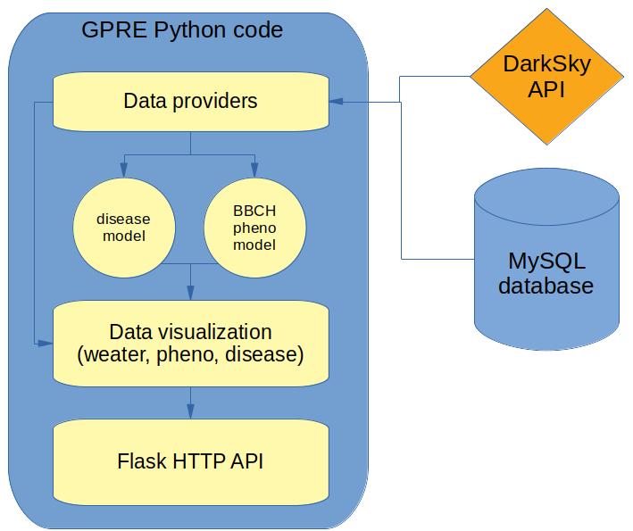

GPRE overview
=============

Service components
------------------

The overall goal of the Golden Paddy Recommendation Engine (GPRE) is to support farmers and analysts in understanding the the impact of weather conditions on crop development, disease and extreme weather. GPRE provides several agronomic services for this purpose:
   - Weather related services
      * maps of forecasted weather variables for all regions in Myanmar based on the forecast from DarkSky (7 days ahead)
      * charts of weather variables for all regions in Myanmar. Charts include the data from the current year, previous year, the climatology and the weather forecast.
   - Disease related services (rice only):
      * Maps of susceptibility for 5 common rice diseases plus an indicator showing current conditions compared to the climatology (alerts)
      * Charts of susceptibility for 5 common rice diseases including the current year, forecast and the climatology.
   - Prediction of crop stages:
      * Phenological stages are predicted according to the BBCH scale for four crops and several varieties (maize, sugar cane, mungbean and rice) based on location, weather and sowing date. If crop management messages are provided for the given crop and variety, the system can also provide the dates on which those messages could be sent to the farmer given the relevant crop stage.

This documentation provides an overview of the current implementation of GPRE including the data sources used, modelling approach for phenology and disease and technical information related to deployment, debugging and extending GPRE with new crops.

Technical components
--------------------

The main components of GPRE are:

- Modules written in python, which provide

    * Data providers for weather data (DarkSky forecast as well as historical weather data and the climatology)
    * Data providers for crop related data.
    * Visualization of results in HTML charts.
    * HTTP API's based on Flask that be called with parameters and return the results as JSON.
    * Execution of tasks (computing of cached results for the weather maps and disease maps).

- A MySQL database which contains:

    * Crop and variety specific characteristics/parameters required for the crop model
    * Messages related to crop management.
    * Historical weather data and the corresponding climatology based on `ERA-INTERIM`_
    * Cached results for weather and disease maps

- Simulation models written in python which provide:

    * Prediction of crop stages and related messages
    * Prediction of disease susceptibility

The figure below provides a graphical overview of the main GPRE components.

.. _PCSE: http://pcse.readthedocs.io
.. _ERA-INTERIM: https://www.ecmwf.int/en/forecasts/datasets/reanalysis-datasets/era-interim

