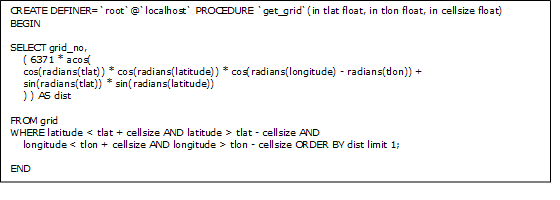

GEOBIS MySQL database
=====================

MySQL is an open-source relational database management system (RDBMS). The GEOBIS MySQL database (geobis_pcse, see figure below) contains a number of tables, which are explained below in more detail.

 
The geobis_pcse database (see figure above) contains the following data:

- Crop tables: containing crop (and variety) specific crop characteristics, including management and weather alerts
- Weather tables: containing weather data, including weather forecast, weather stations observations and a Long Term Archive (LTA-archive)
- Grid tables: containing links between grid number (grid_no) and the geographic location (latitude and longitude)

.. _croptable:

Crop table
----------
*(crop)*

Contains the list of crops (crop_name) with corresponding crop ID (crop_no).

 
Variety table
-------------
*(varieties)*

This table makes it possible to include crop varieties. Crop varieties can be added if specific varieties differ significantly, e.g. varieties that have a much longer or shorter growing season. In case no varieties are listed in the table, the general crop characteristics will be used by the model. For example: in case of Eggplant no variety specific information is listed. That means that ALL eggplant varieties will behave identical.

Contains the list of crop variety names (variety_name), with corresponding variety ID (variety_no) and crop_no.

.. _cropparametervalues:
 
Crop parameter values
---------------------
*(crop_parameter_value)*

This table contains crop specific (**NOT variety specific!**) crop characteristics that define the crop development rate and the defined crop stages as a function of the weather.

Per crop the following information is listed in the table:

- Crop ID (crop_no)
- General crop characteristics consisting of parameter_codes, parameter_values and parameter descriptions:

	+-----------------+---------------------------------------+-----------------------------------------------------+
	| Parameter_code  | Parameter_value                       | Parameter_description                               |
	+=================+=======================================+=====================================================+
	| PHENO_TF        | [Tbase,0,Toptimum,1,Tmaximum,0 or 1]  | Temperature function for phenological development   |
	+-----------------+---------------------------------------+-----------------------------------------------------+
	| PHENO_TBASE     | Tbase                                 | Base temperature [degrees Celsius]                  |
	+-----------------+---------------------------------------+-----------------------------------------------------+
	| MAX_DURATION    | no. days                              | Maximum length growing seasons [days]               |
	+-----------------+---------------------------------------+-----------------------------------------------------+
	| BBCH_01         | TSUM_BBCH_01 [degrees Celsius]        | seed sowing                                         |
	+-----------------+---------------------------------------+-----------------------------------------------------+
	| BBCH_10         | TSUM_BBCH_10 [degrees Celsius]        | seedling emergence                                  |
	+-----------------+---------------------------------------+-----------------------------------------------------+
	| BBCH_xx         | TSUM_BBCH_xx [degrees Celsius]        | ...                                                 |
	+-----------------+---------------------------------------+-----------------------------------------------------+
	

	* PHENO_TF and PHENO_TBASE: Minimum (or base) and maximum temperatures that define limits of growth and development of an organism, and an optimum temperature at which growth proceeds with greatest rapidity. All together these temperatures are also known as the cardinal temperatures.

	  PHENO_TF is defined as follows: [Tbase, 0, Toptimum, 1, Tmaximum, 0],

	  where 0 and 1 represent the minimum and maximum growth response of (0: no growth, 1: maximum growth) of the crop.
	  
	  In case PHENO_TF consists of 3 cardinal temperatures with corresponding 0,1,0 response values you define a typical triangular response model, see red curve in figure below.
	  By introducing 2 optimum temperatures (black-dotted curve) or by changing the response of the crop at the maximum temperature (green curve) you can adjust the temperature response curve of the crop accordingly.

	.. image:: figures/Crop_response_cardinal_temp.png
	   :scale: 75 %
	
	* MAX_DURATION: Maximum length of the growing season (days)
	
	* BBCH: crop development stages, defined as BBCH scale, with corresponding TSUM values. Typical BBCH values are:

	  + BBCH_01 (seed sowing)
	  + BBCH_10 (emergence)
	  + BBCH_15 (5th leaf)
	  + BBCH_61 (first flowering)
	  + BBCH_81 (start of harvest period)
	  + BBCH_89 (end of harvest period – last harvest)
	  + For each development stage (BBCH) a TSUM value (in degrees Celsius) has to be provided.

For each crop development stage (BBCH_no) that needs to be modelled a corresponding TSUM has to be set. The given TSUM-values together with the observed + forecasted weather data and the given sowing date will lead to dates when the defined crop development stages will be reached.

When (the date) the various development (BBCH) stages are reached they are provided in the JSON string as follows:

.. image:: figures/Tsum_values_JSON.png

Variety parameter values
------------------------
*(variety_parameter_value)*

This table contains variety specific (**NOT crop specific!**) crop characteristics that define the crop development rate and the defined crop stages as a function of the weather (air temperature).

At this moment no crop variety specific crop characteristics are known.

Management and Weather alerts
-----------------------------

.. _managementalerts:

Management alerts
~~~~~~~~~~~~~~~~~
*(management_alerts)*

In this table so-called management alerts or advice can be set. The management alerts can be linked to specific crop development stages of the crop (BBCH_code), which have been defined for that specific crop in the crop_parameter_value table. Once a specific crop stage is reached, management alerts that are linked to that specific BBCH_code will be triggered. With the offset_days the alert can be set a couple of days earlier (negative offset_days) or later (positive offset_days).

Management alerts are linked to SMS messages via the SMS panel (GEOBIS Aggregator platform) via message ID’s (message_no). For each crop (crop_no) a number of management alerts can be defined, starting with message_no 1 (the so-called message ID’s). The maximum number of messages is ~15 per crop per growing season, i.e. a farmer will receive 15 SMS messages during the growing season. The message_no’s are linked to a specific SMS message (in English and/or Bangla) configured in GEOBIS Aggregator platform.

The management alerts appear in the JSON string as follows:

For each “management alert” the date (“day”) and message ID (message_no / “msg_id”) are given in the JSON string.

The table below shows an overview of the defined management_alerts for a number of crops. 

For each new management the following information needs to be defined:

- Crop ID (crop_no)
- Crop variety (variety_no). In case it is a crop general management alert this needs to be set at -1.
- Message ID (message_no)

	* **For now the management message ID’s are restricted between 1 – 499.** These are linked to the SMS panel (GEOBIS Aggregator platform).
	
- Offset_days: By setting an offset_day the alert can be triggered earlier (negative offset_day) or later (positive offset_day) than the date when that specific development stage is reached. For example BBCH_15 defines when the crop is ready to be transplanted from the nursery. By setting the offset_day to -7, the alert is triggered/set 7 days earlier, so the farmer has time to prepare the transplanting activities.
- Management message (management_msg). The message_msg in the table is just for internal documentation, it’s not included in the JSON string and not required for the SMS panel (GEOBIS Aggregator platform).

.. _weatheralerts:

Weather alerts
~~~~~~~~~~~~~~
*(weather_alerts)*

In this table so-called weather alerts can be set. In case severe weather is expected leading to crop damage, the farmer can be informed so he/she can take preventive measures. For now 5 different type of weather alerts are defined:

- Heat stress alert (msg_id = 501)
- Cold stress alert (msg_id = 502)
- Humidity stress alert (msg_id = 503)
- Rain stress alert (msg_id = 504)
- Fog alert (msg_id = 505)

**The weather alert ID’s are restricted between 500 – 999 (in order to distinct them from the management alerts in GEOBIS Aggregator platform).**

Note that weather alerts should only be triggered when the farmer is able to take preventive measures (included in the SMS).

For each of the 5 defined weather alerts the following information needs to be defined:

	**Heat stress alert:**

	In case of (extreme) heat conditions the system can trigger a heat stress alert. This alert is triggered by defining a threshold value (degrees Celsius) and a duration value (days). Once the maximum air temperature becomes higher than the threshold value for 1 day or more (set with the duration value) this alert is triggered. Furthermore, the weather alert can be linked to 1 or more specific crop development stage (BBCH stage). For example, small plants or plants during flowering can be more sensitive to heat stress than mature plants.

	- Crop ID (crop_no)
	- Variety ID (variety_no). In case it is a crop general management this needs to be set at -1.
	- message_no (message ID): **501** for heat stress alert
	- Parameters heat stress alert:

		{'TMAX_CRIT_BBCH':["BBCH_xx","BBCH_xx"],'TMAX_CRIT':[30,30],'TMAX_STRESS_DURATION':3}'

		In case the alert needs to be set for more BBCH stages, more can be added between the [] for TMAX_CRIT_BBCH. Note that also the threshold value TMAX_CRIT needs to be included in the []. TMAX_CRIT can vary per BBCH stage. 

	- weather_msg: heat stress. This message is shown in the JSON string
	- signal: TMAX_STRESS. For internal use only.

	**Cold stress alerts:**

	In case of (extreme) cold conditions the system can trigger a cold stress alert. This alert is triggered by defining a threshold value (degrees Celsius) and a duration value (days). Once the minimum air temperature drops below the threshold value for 1 day or more (set with the duration value) the alert is triggered. Furthermore, the weather alert can be linked to 1 or more specific crop development stage (BBCH stage). For example, small plants can be more sensitive to cold stress than mature plants.

	- Crop ID (crop_no)
	- Variety ID (variety_no). In case it is a crop general management this needs to be set at -1.
	- message_no (message ID): **502** for cold stress alert
	- Parameters heat stress alert:

		{'TMIN_CRIT_BBCH':["BBCH_xx","BBCH_xx"],'TMIN_CRIT':[10,10],'TMIN_STRESS_DURATION':2}

		In case the alert needs to be set for more BBCH stages, more can be added between the [] for TMIN_CRIT_BBCH. Note that also the threshold value TMIN_CRIT needs to be included in the []. TMIN_CRIT can vary per BBCH stage.

	- weather_msg: cold stress. This message is shown in the JSON string
	- signal: TMIN_STRESS. For internal use only.

	**Humidity stress alerts:**

	In case of (extreme) humid conditions (that could trigger diseases or infestations) the system can trigger a humidity stress alert. This alert is triggered by defining a threshold value (%) and a duration value (days). Once the relative humidity drops becomes higher than the threshold value for 1 day or more (set with the duration value) the alert is triggered. Furthermore, the weather alert can be linked to 1 or more specific crop development stage (BBCH stage).

	- Crop ID (crop_no)
	- Variety ID (variety_no). In case it is a crop general management this needs to be set at -1.
	- message_no (message ID): **503** for humidity stress alert
	- Parameters heat stress alert:

		{'RHMAX_CRIT_BBCH':["BBCH_xx"],'RHMAX_CRIT':[80],'RHMAX_STRESS_DURATION':3}

		In case the alert needs to be set for more BBCH stages, more can be added between the [] for RHMAX_CRIT_BBCH. Note that also the threshold value RHMAX_CRIT needs to be included in the []. RHMAX_CRIT can vary per BBCH stage.

	- weather_msg: RH max stress. This message is shown in the JSON string
	- signal: RHMAX_STRESS. For internal use only.

	**Rain stress alerts:**

	In case of (extreme) rain conditions (that could trigger diseases or infestations or lead to drainage problems) the system can trigger a rain stress alert. This alert is triggered by defining a threshold value (mm per day) and a duration value (days). Once the daily total rainfall becomes higher than the threshold value for 1 day or more (set with the duration value) the alert is triggered. Furthermore, the weather alert can be linked to 1 or more specific crop development stage (BBCH stage).

	- Crop ID (crop_no)
	- Variety ID (variety_no). In case it is a crop general management this needs to be set at -1.
	- message_no (message ID): **504** for rain stress alert
	- Parameters heat stress alert:

		{'RAIN_CRIT_BBCH':["BBCH_xx"],'RAIN_CRIT':[40],'RAIN_DURATION':2}

		In case the alert needs to be set for more BBCH stages, more can be added between the [] for RAIN_CRIT_BBCH. Note that also the threshold value RAIN_CRIT needs to be included in the []. RAIN_CRIT can vary per BBCH stage.

	- weather_msg: rain stress. This message is shown in the JSON string
	- signal: RAIN_STRESS. For internal use only.

	**Fog alerts:**

	In case of (extreme) fog conditions (that could trigger diseases or infestations) the system can trigger a fog alert. The alert is triggered by defining a couple of threshold values (relative humidity (%), minimum wind speed (m/s), minimum air temperature (degrees Celsius), duration value (days) and for which months (1 = January,...12 = December)). Furthermore, the weather alert can be linked to 1 or more specific crop development stage (BBCH stage). The alert is triggered when RH24 > RH_crit, Tmin < Tmin_crit and Wind > Wind_crit.

	- Crop ID (crop_no)
	- Variety ID (variety_no). In case it is a crop general management this needs to be set at -1.
	- message_no (message ID): **505** for fog alert
	- Parameters fog alert:

		{'CRIT_BBCH':["BBCH_xx","BBCH_xx"],'RHMAX_CRIT':[70,70],'UMIN_CRIT':[0.3,0.3],'TMIN_CRIT':[15,15],'FOG_DURATION':1,'FOG_RELEVANT_MONTHS':[12,1,2]}

		In case the alert needs to be set for more BBCH stages, more can be added between the [] for CRIT_BBCH. Note that also the threshold values for RHMAX_CRIT, UMIN_CRIT and TMIN_CRIT needs to be included in the []. RHMAX_CRIT, UMIN_CRIT and TMIN_CRIT can vary per BBCH stage.

	- weather_msg: fog alert. This message is shown in the JSON string
	- signal: FOG. For internal use only.

The weather alerts appear in the JSON string as follows:

For each “weather alert” the date (“day”) and message ID (message_no / “msg_id”) are given in the JSON string.
The date indicates the day when the extreme weather conditions (alert) are expected (in case of a duration of 1 day) or the start of the period with extreme weather conditions (in case of a duration of more than 1 day).

**Limitations weather forecast:**

The weather alert simulator also uses the weather forecast information, i.e. so it can also trigger weather alerts for the coming days. The GFS weather forecast includes 10 days (which includes today (d0), tomorrow (d1),... d9). However the reliability of the forecast decreases significantly after ~3 days (which can lead to appearing/disappearing weather alerts every time the forecast is updated). **Therefore, we have set a limit to the weather alerts of 3 days (today, tomorrow and the day after tomorrow).**
The weather limit can be set in simulator.py (in the folder \\branches\reorganize\config\\)

The table below shows an overview of the defined weather alerts for each crop.

Weather database tables
-----------------------

The following section provides an overview of all database tables that are required for the weather data, and are used by the crop model:

- grid_weather_forecast
- grid_weather_forecast_d0
- grid_weather_LTA
- grid_weather_observed

The format of each table is identical:

- Grid_no [1 to 22400]
- Date [yyyy-mm-dd]
- Maximum air temperature [degrees Celsius]
- Minimum air temperature [degrees Celsius]
- Vapour pressure [kilo Pascal]
- Wind speed [m/s]
- Rainfall [mm/day]
- e0, Penman potential evaporation from a free water surface [mm/day]
- es0, Penman potential evaporation from a moist bare soil surface [mm/day]
- et0, Penman potential transpiration from a crop canopy [mm/day]
- calculated radiation [Joule/meter^2/day]
- snow depth [m]

All together these tables are used to construct a time-series of weather data for each specific location (grid cell), so that for each request the crop model can run for the entire growing season, starting at the sowing date. 

The weather data time-series is constructed as follows (see also section Stored Procedures):

- 1 LTA_year (based on GSOD), grid_weather_LTA
- Observations current year (GSOD), grid_weather_observed
- First day of the forecast from 2 days ago (= d0 (GFS today-2), grid_weather_forecast_d0
- First day of the forecast from yesterday (= d0 (GFS today-1), grid_weather_forecast_d0
- 10-day forecast of today (= d0, d1, .., d9), grid_weather_forecast
- 1 LTA_year (based on GSOD), grid_weather_LTA (starting at d9+1)

This constructed times series is used as input to the crop model, so that based on the provided sowing date the crop development for the whole growing season can be modelled.

**Limitation weather archive:**

In order to have maximum performance the observed weather database is limited to the current year/season only.

Grid
~~~~
*(grid)*

Contains the grid cell ID’s and corresponding latitude and longitude [decimal degrees]. The total number of grid cells is 140 (columns - longitude) * 160 (rows - latitude) = 22400 (range grid ID: 1 - 22400), which cover whole Bangladesh, at 5km spatial resolution (i.e. each grid cell is ~5x5 km^2).
This table is required to link the coordinates in the request to a specific grid cell. Once the grid cell is known the weather data can be extracted to construct a time-series of weather data, this is used in the crop model.

The table below shows an overview of the grid table.

Grid weather forecast
~~~~~~~~~~~~~~~~~~~~~
*(grid_weather_forecast)*

Contains daily GFS modelled weather forecast data (10 days forecast). GFWS forecast (10 days): today (d0), tomorrow (d1), ... etc. (d9). This table is updated on a daily basis once the new GFS forecast has been downloaded and processed.

The table below shows an overview of the grid_weather_forecast table.

.. image:: figures/grid_weather_forecast.png

Grid weather forecast d0
~~~~~~~~~~~~~~~~~~~~~~~~
*(grid_weather_forecast_d0)*

This table contains only the first day (d0) weather forecasts of the daily collected GFS forecast (~of the last year). This ‘d0-GFS-archive’ are used to ‘fill’ days with missing observed weather (GSOD) data. Normally GSO has a delay of 1-2 days to the current day. But occasionally it can grow up to 10 days or more. Missing ‘GSOD-days’ are then filled with ‘d0-GFS-days’ from the archive. Table is updated on a daily basis.

Grid weather LTA
~~~~~~~~~~~~~~~~
*(grid_weather_LTA)*

Contains Long Term Average (LTA) archive based on gridded GSOD observations (for the period 2005-2015). The LTA is used in the gridding of the GSOD data, in case the number of weather variables is too low (min_IDW = 10). In that case LTA-data is used.

Note that grid_weather_LTA uses the following day number format (rather than date): mmdd.

Grid weather observed
~~~~~~~~~~~~~~~~~~~~~
*(grid_weather_observed)*

Contains gridded observed weather (GSOD) data for the current year. Table is updated on a daily basis.

Date manipulation
~~~~~~~~~~~~~~~~~
*(date_manipulation)*

This table contains a link between dates for a year (period 1980 – 2029) and corresponding mmdd-values. The table is used to link the LTA-archive to observed and forecasted archives that use a date.
In case the sowing date lies is before the current year, the whole model run will be based on the LTA-archive.

Stored MySQL procedures
-----------------------
The MySQL database includes a number of procedures that are part of the crop model service:

1. Get_grid
2. Get_grid_weather
3. Missing_dates_in_GSOD

Get_grid
~~~~~~~~
This procedure is used to derive the right grid cell based on the location coordinates in the request. The grid cell ID is required to extract the weather data from the database.

Get_grid_weather
~~~~~~~~~~~~~~~~
This procedure is used to construct a whole time series of weather data based on the weather forecast, weather observations and historic (LTA) weather archive.

The weather data time-series is constructed as follows:

1. 1 LTA_year (based on GSOD), taken from grid_weather_LTA
2. Observations current year (GSOD), taken from grid_weather_observed
3. First day of the forecast from 2 days ago (= d0 (GFS today-2), taken from grid_weather_forecast_d0
4. First day of the forecast from yesterday (= d0 (GFS today-1) taken from grid_weather_forecast_d0
5. 10-day forecast of today (= d0, d1, .., d9), taken from grid_weather_forecast
6. 1 LTA_year (based on GSOD), taken grid_weather_LTA (starting at d9+1)

The constructed weather data time series is than the basis for the crop model, which is than long enough to cover all active requests form sowing data to the end of the growing season.

Occasionally, it can happen that GSOD has delay of more than 2 days. In that case the missing dates are filled with more first day (d0) forecasts from the GFS archive (grid_weather_forcast_d0).

Missing_dates_in_GSOD
~~~~~~~~~~~~~~~~~~~~~
Occasionally, it can happen that GSOD has a delay of more than 2 days. In that case the missing dates are filled with more first day forecast from the GFS archive (grid_weather_forcast_d0).

Request database tables
-----------------------

All incoming requests:

e.g. http://52.29.108.56/geobis/geobis.py?lat=22.034&lon=88.0101&cropid=10&sowday=20170929
or http://52.29.108.56/geobis/geobis.py?lat=22.034&lon=88.0101&cropid=10&varid=1&sowday=20170929
are stored in the MySQL database. 

This is done so that every day (early in the morning) all requests can be updated using the updated weather data.
Newly incoming requests are added to the list of active requests (requests_active), until the end of the growing season is reached. Than the requests are moved to reguests_finished table.

Active requests
~~~~~~~~~~~~~~~
*(requests_active)*

Contains list of active requests, i.e. requests for crop model simulations that not have reached the end of the growing season.

The table contains the following information:

- The original request (request_id), which includes cropid, location and sowing date.
- Time stamp (tstamp), ????
- The crop model results (result), which contains the full JSON string.

The table below shows an overview of the requests_active table.

Finished requests
~~~~~~~~~~~~~~~~~
*(requests_finished)*

Contains list of finished requests, i.e. requests for crop model simulations that have reached the end of the growing season. Therefor they no longer need to be processed and updated as part of the SMS service to the farmers.

The format of this table is identical to the requests_active table.