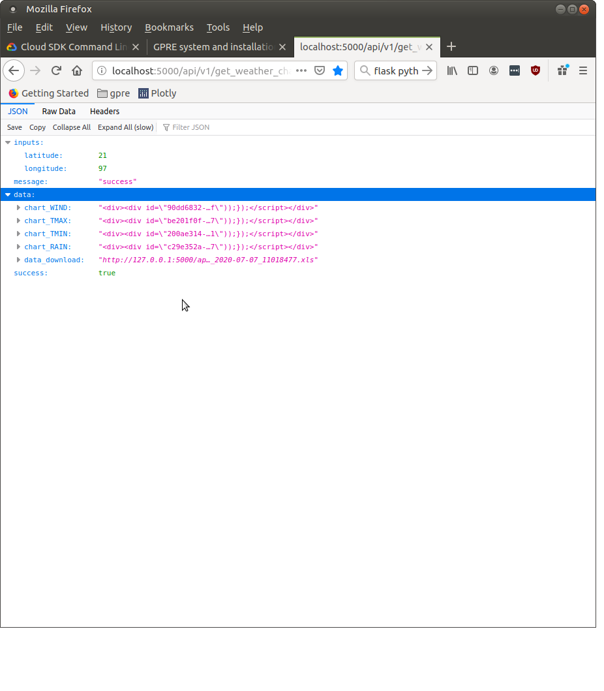
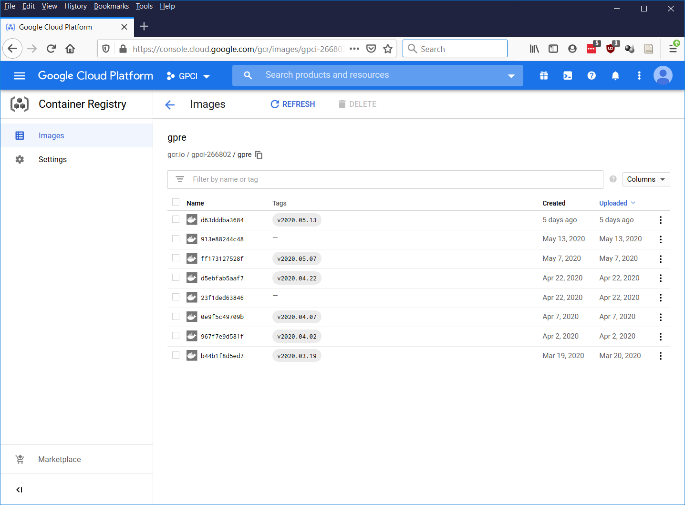
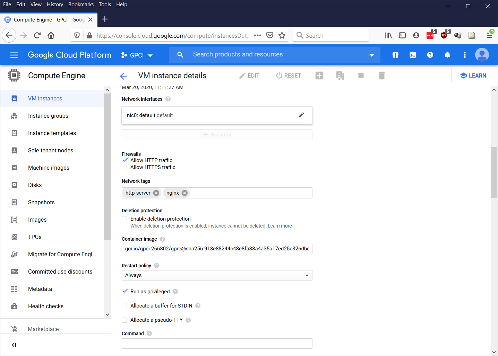

GPRE system and installation
============================

Overview of the repository
--------------------------

The list below shows an overview of the directory layout of the GPRE code and a description of the content of the different sub-directories::

    └── GPRE                             - Root directory and various scripts for docker and flask
        ├── docker_base                  - Scripts for creating the base docker image;
        └── gpre                         - the GPRE code root directory
            ├── cache                    - cache and temporary files
            ├── config                   - System configuration and settings
            ├── db_struct                - SQL scripts for building the MySQL database
            ├── doc                      - Documentation for GPRE, built with Sphinx
            │   └── figures              - Figures for the documentation
            ├── downloads                - File downloads are written here
            ├── gpre                     - Python code implementing GPRE services
            ├── logs                     - Log files are written here
            ├── notebooks                - Notebooks, mainly for estimating GDD for phenology for different crops
            ├── pcse                     - The PCSE package that is used by the models for crop stages prediction and disease
            ├── phenology                - The model for simulating phenological development
            ├── tasks                    - Python scripts that implement scheduled tasks
            └── webserver                - Python scripts that implement the HTTP API to call GPRE services

System configuration
--------------------

The configuration of GPRE has been implemented as a python package which allow to import the whole configuration and access the various configuration settings by typical python notation (e.g. ``config.database.default_user``). The configuration has been split into sections with the following structure::

    config/__init__.py    - Top level configuration (logging, site name, etc.)
        ├── database.py   - Database credentials to access the database
        ├── disease.py    - Disease related settings
        ├── simulator.py  - Settings related to phenology simulation
        ├── weather.py    - Settings related to weather (e.g. DarkSky API key)
        ├── webserver.py  - Web server related settings (IP address under which GPRE is running)

Most of the configuration settings do not need to be touched. However if database credentials or IP addresses change this may be required.

Setting up GPRE on your local desktop
-------------------------------------

Often if is useful to run the GPRE services on your local desktop in order to debug a service, develop additional services or have a closer look at a certain output. However, every GPRE service needs to connect to the GPRE database in order to retrieve weather data and/or crop parameters. Therefore, installing GPRE locally involves several steps:

  1. Installing a python distribution and the required packages
  2. Installing the Google Cloud SQL proxy to connect to the MySQL database
  3. Starting GPRE through python, flask or docker

Below, we assume that GPRE will be installed on a PC running Linux (Ubuntu or similar).

Setting up a python environment
...............................

The most convenient way to setup a python environment is through the `miniconda`_ python installer. After downloading and installing miniconda a new python environment must be created. Current GPRE still runs on a python 2.7 environment. Although python 2.7 is officially end-of-life this will not be problematic as long as the GPRE API is not directly exposed to the internet. A new python environment can be created with the following command:

.. code-block:: console

    conda create -n py27_gpre python=2.7  pymysql sqlalchemy pandas numpy pyyaml flask xlwt xlrd requests jupyter sphinx

When the environment has been created, it can be activated with:

.. code-block:: console

    (base) wit015@d0137094:~$ conda activate py27_gpre
    (py27_gpre) wit015@d0137094:~$

Some additional packages still need to be installed with the `pip` installer:

.. code-block:: console

    (py27_gpre) wit015@d0137094:~$ pip install yattag dotmap plotly==3.6
    ...
    Successfully installed dotmap-1.3.17 typing-3.7.4.1 yattag-1.13.2 plotly-3.6.0
    (py27_gpre) wit015@d0137094:~$

The conda environment is now ready for use on your local PC. Note that for the operational deployment of GPRE, installation of python and its dependencies for GPRE are taken care of by the docker image.

.. _miniconda: https://docs.conda.io/en/latest/miniconda.html

Connecting to the MySQL database
................................

The MySQL database is running in the Google cloud as a managed database service. A database running within the Google cloud cannot be access directly from outside for security reasons. Therefore special software has to be used to make your local desktop PC connect to the GPRE database, this special software is the Google `Cloud_SQL_proxy`_. The cloud SQL proxy creates a secure tunnel between your local desktop and the Google Cloud project where the database is running and forwards the requests to the database. Use of the Cloud SQL proxy is free of charge.

Installing the `Cloud_SQL_proxy`_ is simple as it is a self-contained binary, however it requires that the `Google Cloud SDK`_ is installed and that the Google project where the database is running is registered as the default project. With the Google SDK installed, starting the cloud proxy can be done using:

.. code-block:: console

    wit015@d0137094$ ./cloud_sql_prox -instances=gpci-266802:us-central1:gpre-mysql=tcp:3310
    2020/07/07 12:01:16 Rlimits for file descriptors set to {&{8500 1048576}}
    2020/07/07 12:01:16 Listening on 127.0.0.1:3310 for gpci-266802:us-central1:gpre-mysql
    2020/07/07 12:01:16 Ready for new connections

The cloud proxy has now connected to the google cloud and created a tunnel to the GPRE MySQL database which listens at the localhost (127.0.0.1) at port 3310. The id string that is given after the `-instances` option can be taken from the DB administration page on the Google Cloud portal.

The actual connection can now be made using any MySQL client using the proper database username/password. In the example below we use the MySQL commandline utility:

.. code-block:: console

    wit015@d0137094$ mysql -u gpre -p -h 127.0.0.1 -P 3310
    Enter password:
    Welcome to the MySQL monitor.  Commands end with ; or \g.
    Your MySQL connection id is 880049
    Server version: 5.7.25-google-log (Google)

    Copyright (c) 2000, 2020, Oracle and/or its affiliates. All rights reserved.

    Oracle is a registered trademark of Oracle Corporation and/or its
    affiliates. Other names may be trademarks of their respective
    owners.

    Type 'help;' or '\h' for help. Type '\c' to clear the current input statement.

    mysql> use gpre;
    Reading table information for completion of table and column names
    You can turn off this feature to get a quicker startup with -A

    Database changed
    mysql> select * from crop;
    +---------+-----------+
    | crop_no | crop_name |
    +---------+-----------+
    |       1 | Maize     |
    |      11 | Rice      |
    |      13 | Sugarcane |
    |      14 | Mung bean |
    +---------+-----------+
    4 rows in set (0.11 sec)

    mysql>

The Cloud SQL proxy will also show that a new connection has been made:

.. code-block:: console

    2020/07/07 12:05:27 New connection for "gpci-266802:us-central1:gpre-mysql"

Similarly the connection can be made from within python using the database credentials that are set in the GPRE configuration at `config/database.py`. However, it is important that the environment variable `DEVELOP` is set in order to indicate to GPRE that we are running in DEVELOP mode and not in the docker image on the Google Cloud. Note that we are adding the location where GPRE can be found to the python path which will vary depending on where you put GPRE on your system:

.. code-block:: console

    (py27_gpre) wit015@d0137094:~$ export DEVELOP=1
    (py27_gpre) wit015@d0137094:~$ python
    Python 2.7.18 |Anaconda, Inc.| (default, Apr 23 2020, 22:42:48)
    [GCC 7.3.0] on linux2
    Type "help", "copyright", "credits" or "license" for more information.
    >>> import sys
    >>> sys.path.append("/home/wit015/Projects/SAMM/GPRE/gpre")
    >>> import config
    using DEVELOP DB settings!
    >>> import sqlalchemy as sa
    >>> engine = sa.create_engine(config.database.dbc)
    >>> DBcon = engine.connect()
    >>> cursor = DBcon.execute("select * from crop")
    >>> print(cursor.fetchall())
    [(1, 'Maize'), (11, 'Rice'), (13, 'Sugarcane'), (14, 'Mung bean')]

We can now start to test GPRE on the local PC or run the notebooks for setting up a new crop for the crop prediction service. Note that the Cloud SQL proxy should be running whenever we want to connect to the MySQL GPRE database.

Running GPRE locally
...................

For running GPRE from a local python interpreter examples can found in the folder  `tasks/`. Running the script `tasks/gpre_examples.py` will produce the following output:

.. code-block:: json

    (py27_gpre) wit015@d0137094:~/Projects/SAMM/GPRE/gpre/tasks$ python gpre_examples.py
    /home/wit015/Projects/SAMM/GPRE/gpre/tasks
    using DEVELOP DB settings!
    {
     "managementalerts": [
      {
       "msg": "Weed control",
       "msg_id": "7",
       "day": "2019-08-28"
      },
      {
       "msg": "Scouting for pest and disease control",
       "msg_id": "12",
       "day": "2019-09-04"
      },
      {
       "msg": "Second fertilizer application",
       "msg_id": "5",
       "day": "2019-09-08"
      },
      {
       "msg": "Weed control",
       "msg_id": "8",
       "day": "2019-09-07"
      },
      {
       "msg": "Check leaf colour for nutrient deficiency",
       "msg_id": "10",
       "day": "2019-09-07"
      },
      {
       "msg": "Scouting for pest and disease control",
       "msg_id": "13",
       "day": "2019-09-16"
      },
      {
       "msg": "Third fertilizer application",
       "msg_id": "6",
       "day": "2019-10-11"
      },
      {
       "msg": "Weed control",
       "msg_id": "9",
       "day": "2019-10-10"
      },
      {
       "msg": "Check leaf colour for nutrient deficiency",
       "msg_id": "11",
       "day": "2019-10-10"
      },
      {
       "msg": "Scouting for pest and disease control",
       "msg_id": "14",
       "day": "2019-10-14"
      },
      {
       "msg": "Scouting for pest and disease control",
       "msg_id": "15",
       "day": "2019-10-31"
      },
      {
       "msg": "Prepare for harvest",
       "msg_id": "16",
       "day": "2019-12-14"
      },
      {
       "msg": "Harvesting can begin: check weather forecast",
       "msg_id": "17",
       "day": "2019-12-19"
      },
      {
       "msg": "Thresh and dry maize kernels",
       "msg_id": "18",
       "day": "2019-12-23"
      },
      {
       "msg": "Arrange proper storage (sacks and warehouse). Check for pests",
       "msg_id": "19",
       "day": "2020-01-02"
      }
     ],
     "weatheralerts": [],
     "phenology": [
      {
       "bbch": "BBCH_01",
       "day_current": "2018-08-15T00:00:00",
       "dap_avg": 1,
       "dap_current": 0,
       "dap_diff": 1
      },
      {
       "bbch": "BBCH_10",
       "day_current": "2018-08-23T00:00:00",
       "dap_avg": 9,
       "dap_current": 8,
       "dap_diff": 1
      },
      {
       "bbch": "BBCH_13",
       "day_current": "2018-09-05T00:00:00",
       "dap_avg": 21,
       "dap_current": 21,
       "dap_diff": 0
      },
      {
       "bbch": "BBCH_30",
       "day_current": "2018-09-12T00:00:00",
       "dap_avg": 28,
       "dap_current": 28,
       "dap_diff": 0
      },
      {
       "bbch": "BBCH_50",
       "day_current": "2018-10-14T00:00:00",
       "dap_avg": 61,
       "dap_current": 60,
       "dap_diff": 1
      },
      {
       "bbch": "BBCH_60",
       "day_current": "2018-10-18T00:00:00",
       "dap_avg": 64,
       "dap_current": 64,
       "dap_diff": 0
      },
      {
       "bbch": "BBCH_70",
       "day_current": "2018-11-02T00:00:00",
       "dap_avg": 78,
       "dap_current": 79,
       "dap_diff": -1
      },
      {
       "bbch": "BBCH_80",
       "day_current": "2018-11-26T00:00:00",
       "dap_avg": 98,
       "dap_current": 103,
       "dap_diff": -5
      },
      {
       "bbch": "BBCH_89",
       "day_current": "2018-12-23T00:00:00",
       "dap_avg": 127,
       "dap_current": 130,
       "dap_diff": -3
      },
      {
       "bbch": "BBCH_99",
       "day_current": "2018-12-29T00:00:00",
       "dap_avg": 132,
       "dap_current": 136,
       "dap_diff": -4
      }
     ]
    }

Running GPRE using flask
........................

The HTTP API for GPRE has been implemented using `Flask`_. Flask is a micro-web development framework which makes it easy to build an HTTP interface on top of python code. For debugging the web interface and the GPRE services it is often required to start Flask and test the output of the code in your browser. For this purpose Flask has a built-in webserver that can be used for development but should not be used for production environments.

Starting Flask to run the GPRE services must be done from the GPRE root folder using the following commands:

.. code-block:: console

    (py27_gpre) wit015@d0137094:~/Projects/SAMM/GPRE$ export DEVELOP=1
    (py27_gpre) wit015@d0137094:~/Projects/SAMM/GPRE$ python gpre/webserver/flask_app.py
    using DEVELOP DB settings!
     * Serving Flask app "flask_app" (lazy loading)
     * Environment: production
       WARNING: This is a development server. Do not use it in a production deployment.
       Use a production WSGI server instead.
     * Debug mode: on
    [INFO] -  * Running on http://127.0.0.1:5000/ (Press CTRL+C to quit)
    [INFO] -  * Restarting with stat
    using DEVELOP DB settings!
    [WARNING] -  * Debugger is active!
    [INFO] -  * Debugger PIN: 182-242-591

This starts the flask webserver on the local host at port 5000. The GPRE services can now be reached at their HTTP address. For example the following URL generates the weather charts for the given latitude/longitude. Note that the charts are provided as HTML DIV strings and first have to be embedded in the proper HTML layout in order to be visualized.::

    http://localhost:5000/api/v1/get_weather_charts?latitude=21&longitude=97

Running GPRE using docker
.........................

*Building the GPRE Docker image*

As a first step for deploying GPRE on the Google infrastructure it is required to build and test the Docker image that packages GPRE. First, Docker must be installed on the local PC. There is good documentation available for installing `Docker`_ on Ubuntu so we will not repeat that here. Instead we assume that docker is properly installed and the docker commands can be executed by an ordinary (non-root) user.

The first step in building the GPRE docker image is to build the base image. Within this image everything is prepared for GPRE but it does not yet include the GPRE code. The reason for creating a base image is that creating the base image is relatively time-consuming but  only has to be done once. The actual GPRE services image will build upon the base image and will simply add the GPRE code in order to operationalize GPRE.

The GPRE base image itself is based on a third party image which already prepares a linux operating system based on Debian Linux 'Buster'. It includes a  python2.7 installation, the NGINX webserver and the uWSGI framework that provides the connection between NGINX and Flask. Information about this image can be found `here`_.

The definition of the base image is laid out in the `Dockerfile` in the `GPRE/docker_base` directory. The image can be built using the command (note the trailing dot):

.. code-block:: console

    docker build -t gpre/base:v2020.05.07 .
    Sending build context to Docker daemon  3.072kB
    Step 1/3 : FROM tiangolo/uwsgi-nginx-flask:python2.7
     ---> 04d91d0c6044
    Step 2/3 : RUN apt-get update && apt-get install -y --no-install-recommends --no-upgrade python-pip python-setuptools vim.tiny && rm -rf /var/lib/apt/lists/* && rm -rf /var/cache/apk/*
     ---> Using cache
     ---> fae542ac8123
    Step 3/3 : RUN pip install dotmap pymysql sqlalchemy pandas numpy pyyaml flask xlwt xlrd requests yattag plotly==3.6
     ---> Using cache
     ---> 4fcda6056a8c
    Successfully built 4fcda6056a8c
    Successfully tagged gpre/base:v2020.05.07

The option `-t` tags the docker image with a name which includes the date that the Dockerfile was defined. Subsequent versions of the base image should get a new tag updating the date.

*Building the GPRE image*

Next step is to build the GPRE image. The Dockerfile for building the GPRE image is very simple. It takes the base image, creates a folder structure and finally copies the python code required for GPRE into the image. Note that the `FROM` directive in the Dockerfile should point to the latest version of the GPRE base image. The Dockerfile looks like this:

.. code-block:: docker

    FROM gpre/base:v2020.05.07

    RUN mkdir /app/gpre /app/gpre/cache /app/gpre/config /app/gpre/downloads/ /app/gpre/gpre /app/gpre/logs/ \
     /app/gpre/pcse /app/gpre/phenology /app/gpre/tasks /app/gpre/webserver
    COPY ./gpre/config /app/gpre/config
    COPY ./gpre/gpre /app/gpre/gpre
    COPY ./gpre/pcse /app/gpre/pcse
    COPY ./gpre/phenology /app/gpre/phenology
    COPY ./gpre/tasks /app/gpre/tasks
    COPY ./gpre/webserver/flask_app.py /app/main.py

Finally the GPRE Docker image can be built (from within the GPRE top directory where the Dockerfile resides) with:

.. code-block:: console

    $ python -m compileall .
    $ docker build -t gpre/v2020.05.13 .

When listing the available Docker images, it should now show at least the following three images:

.. code-block:: console

    $ docker image ls
    REPOSITORY                                                           TAG                 IMAGE ID            CREATED             SIZE
    gpre/v2020.05.13                                                     latest              a78b2bd16b53        8 minutes ago       1.29GB
    gpre/base                                                            v2020.05.07         4fcda6056a8c        2 months ago        1.28GB
    tiangolo/uwsgi-nginx-flask                                           python2.7           04d91d0c6044        8 months ago        910MB

*Starting and testing the GPRE docker image*

The GPRE docker image can now be started by Docker. This  means that docker creates a container from the image which is then started. One can start multiple containers from one image which could be useful if the GPRE service gets more requests than can be handled by one container. Starting an image is done with the `docker run` command:

.. code-block:: console

    docker run --name=gpre_production --network="host" -d -e DEVELOP='1' gpre/v2020.05.13

Because we are still running on the local desktop some special commands have been added. The `--network="host"` option indicates that the network of the container should not be isolated from the Docker host. This `host networking mode`_ is required because the container needs to connect to the MySQL database through the SQL cloud proxy which runs on the localhost port 3310. Further, the option `-e DEVELOP='1'` sets environment variable `DEVELOP` within the container because we still are running in DEVELOP mode.

We can check that the container is running with:

.. code-block:: console

    $ docker container ls
    CONTAINER ID        IMAGE               COMMAND                  CREATED             STATUS              PORTS               NAMES
    144b7b30624b        gpre/v2020.05.13    "/entrypoint.sh /sta…"   21 minutes ago      Up 21 minutes                           gpre_production

Now the GPRE service should be available on the localhost port 80. In fact, we are running the same code as with the Flask webserver (see above) but now through the NGINX webserver inside a Docker container. This solution is much more portable and robust than the Flask solution (which is for testing only). The GPRE services can be accessed in your browser through the following URL:

    http://localhost/api/v1/get_weather_charts?latitude=21&longitude=97

Which should give the same result as the Flask solution (see above).

*Debugging Docker containers*

Debugging Docker containers can be notoriously difficult. The fact that a container is isolated from the host operating system also means that little feedback is provided on the what goes wrong when running the GPRE image. When the GPRE service fails often the only direct feedback is a `502 Bad Gateway` message displayed in your browser.

The most easy approach I found when debugging docker containers is by accessing the container through the `docker exec` command. For this we first need to find the container ID:

.. code-block:: console

    $ docker container ls
    CONTAINER ID        IMAGE               COMMAND                  CREATED             STATUS              PORTS               NAMES
    b861c364f513        gpre/v2020.05.13    "/entrypoint.sh /sta…"   4 minutes ago       Up 4 minutes                            gpre_production

Next we can connect to the docker container by starting a `bash` shell inside the container with:

.. code-block:: console

    $ docker exec -it b861c364f513 bash
    root@d0137094:/app#

The `root@d0137094:/app#` prompt indicates that you are now inside the container. Now the GPRE services can be started manually with:

.. code-block:: console

    root@d0137094:/app# python main.py
    using DEVELOP DB settings!
    Traceback (most recent call last):
      File "main.py", line 46, in <module>
        from gpre.create_weather_graph import generate_weather_charts_for_location
      File "/home/wit015/Projects/SAMM/GPRE/gpre/gpre/__init__.py", line 7, in <module>
      File "/home/wit015/Projects/SAMM/GPRE/gpre/config/__init__.py", line 19, in <module>
      File "/home/wit015/Projects/SAMM/GPRE/gpre/config/simulator.py", line 9, in <module>
      File "/home/wit015/Projects/SAMM/GPRE/gpre/phenology/__init__.py", line 1, in <module>
      File "/home/wit015/Projects/SAMM/GPRE/gpre/phenology/data_providers.py", line 20, in <module>
      File "/home/wit015/Projects/SAMM/GPRE/gpre/pcse/__init__.py", line 103, in <module>
      File "/home/wit015/Projects/SAMM/GPRE/gpre/pcse/__init__.py", line 91, in setup
    IOError: [Errno 2] No such file or directory: '/app/gpre/pcse/settings/default_settings.py'
    root@d0137094:/app#

The output from the python interpreter now clearly indicates that a file is missing.

Deploying GPRE on the Google Cloud
----------------------------------

First-time deployment of the container
......................................

When the Docker image can be successfully deployed on the local PC and all GPRE services are working correctly, the next step is to deploy it to production into the Google Cloud. The first step is to build to the Docker image again, but instead of writing it into the local Docker registry, we write it towards the `Google Container Registry`_. With the following commands:

.. code-block:: console

    $ docker build -t gcr.io/gpci-266802/gpre:v2020.05.13 .
    $ docker push gcr.io/gpci-266802/gpre:v2020.05.13

The docker image is now registered and available inside the Google Container Registry. The GPRE production service in the Google Cloud can now be started using a `gcloud` command. This assumes that the Google SDK is installed and the gpci project is registered as the default project:

.. code-block:: console

    gcloud compute --project=gpci-266802 instances create-with-container gpre-production --zone=us-central1-a \
                   --machine-type=g1-small --subnet=default --network-tier=PREMIUM \
                   --metadata=google-logging-enabled=true --service-account  \
                   gpre-619@gpci-266802.iam.gserviceaccount.com  --image-family=cos-stable \
                   --image-project=cos-cloud --container-image=gcr.io/gpci-266802/gpre:v2020.05.13 \
                   --container-restart-policy=always --container-privileged --tags=http-server

Accessing the GPRE production service can be done either from a browser window in the `google project SSH`_ or through a terminal on the local machine. For the latter, the SSH key must first be registered in the ssh-agent through `ssh-add`. Next an SSH connection can be started using the `gcloud ssh` command:

.. code-block:: console

    $ ssh-add  ~/.ssh/google_compute_engine
    Enter passphrase for /home/wit015/.ssh/google_compute_engine:
    Identity added: /home/wit015/.ssh/google_compute_engine (/home/wit015/.ssh/google_compute_engine)

    $ gcloud compute ssh gpre-production
    No zone specified. Using zone [us-central1-a] for instance: [gpre-production].
      ########################[ Welcome ]########################
      #  You have logged in to the guest OS.                    #
      #  To access your containers use 'docker attach' command  #
      ###########################################################

    wit015@gpre-production ~ $

You are now logged on the container host (the server that hosts the container and is running it through docker). The actual container can be accessed again through a `docker attach` command using the container ID:

.. code-block:: console

    wit015@gpre-production ~ $ docker container ls
    CONTAINER ID        IMAGE                                                                COMMAND                  CREATED             STATUS              PORTS               NAMES
    4ef2e216e157        gcr.io/gpci-266802/gpre                                              "/entrypoint.sh /sta…"   2 months ago        Up 2 months                             klt-gpre-production-xeif
    1c75589fd329        gcr.io/stackdriver-agents/stackdriver-logging-agent:0.2-1.5.33-1-1   "/entrypoint.sh /usr…"   2 months ago        Up 2 months                             stackdriver-logging-agent
    wit015@gpre-production ~ $ docker exec -it 4ef2e216e157 bash
    root@gpre-production:/app# ls
    gpre  main.py  main.pyc  prestart.sh  uwsgi.ini
    root@gpre-production:/app#

The output from the `ls` command inside the container shows the `main.py` file which is the entrypoint for the GPRE services to run.

Updating the container
......................

When updates to the GPRE service become available it also becomes necessary to update the container running on the container host. This is most easily done from the Google Cloud project interface. First go the Container Registry interface and copy the full container name from the container that you want to deploy. Next go the `Compute Engine` section, select the VM Instance and choose Edit. Next to go the Container image and replace the container image with the the container name you copied from the registry. After saving the changes, the VM instance will be rebooted in order to start the new container. See screenshots below for information.

    Copying a container name from the container registry.

    Replacing a container in a Google VM Instance.

.. _here: https://github.com/tiangolo/uwsgi-nginx-docker
.. _Flask: https://flask.palletsprojects.com/en/1.1.x/
.. _Cloud_SQL_proxy: https://cloud.google.com/sql/docs/mysql/sql-proxy
.. _Google Cloud SDK: https://cloud.google.com/sdk/
.. _Docker: https://docs.docker.com/engine/install/ubuntu/
.. _host networking mode: https://docs.docker.com/network/host/
.. _Google Container Registry: https://cloud.google.com/container-registry/
.. _Google project SSH: https://cloud.google.com/compute/docs/instances/connecting-to-instance