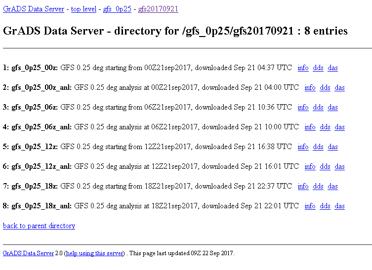
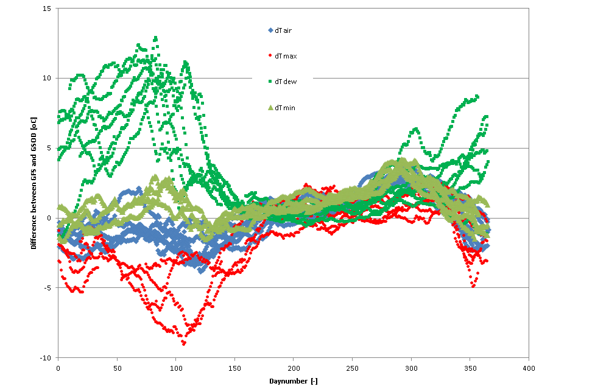
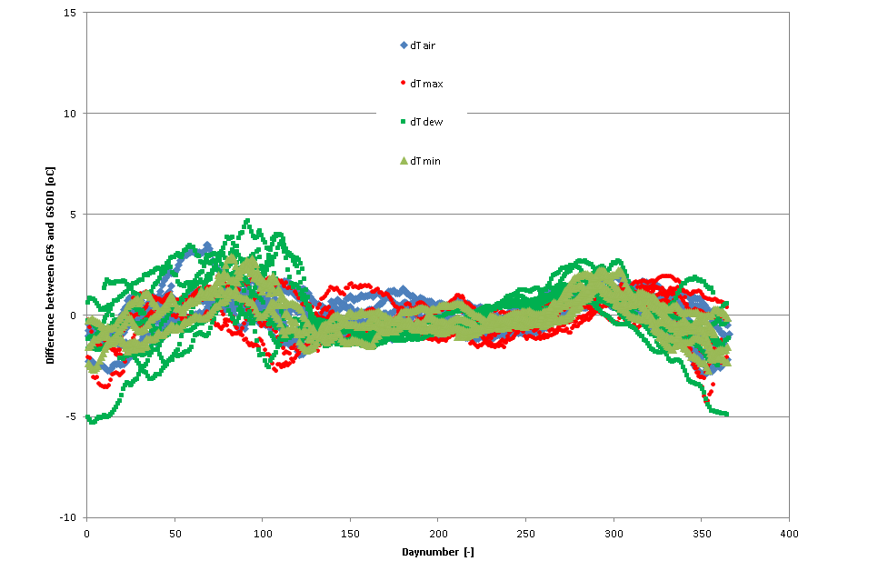
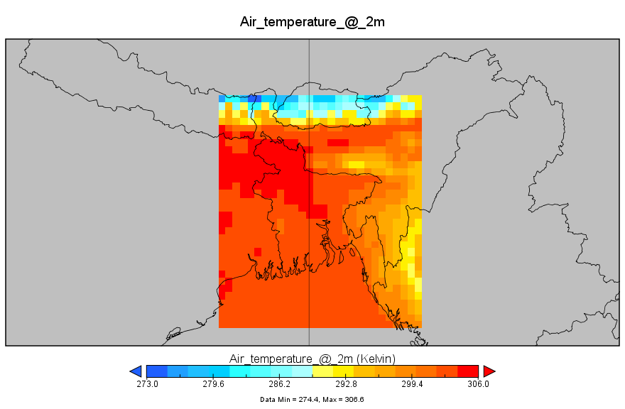
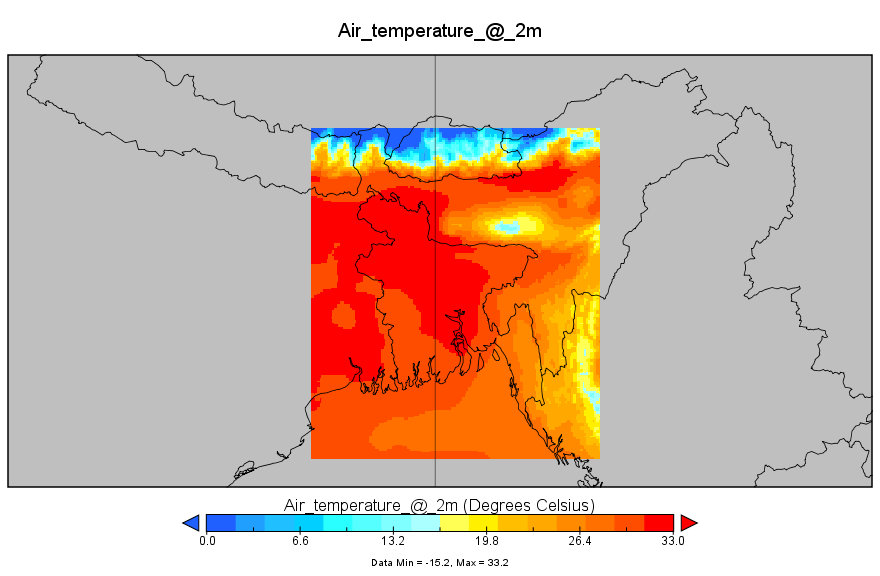
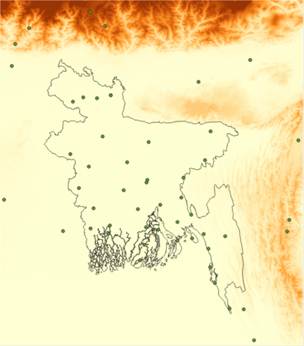
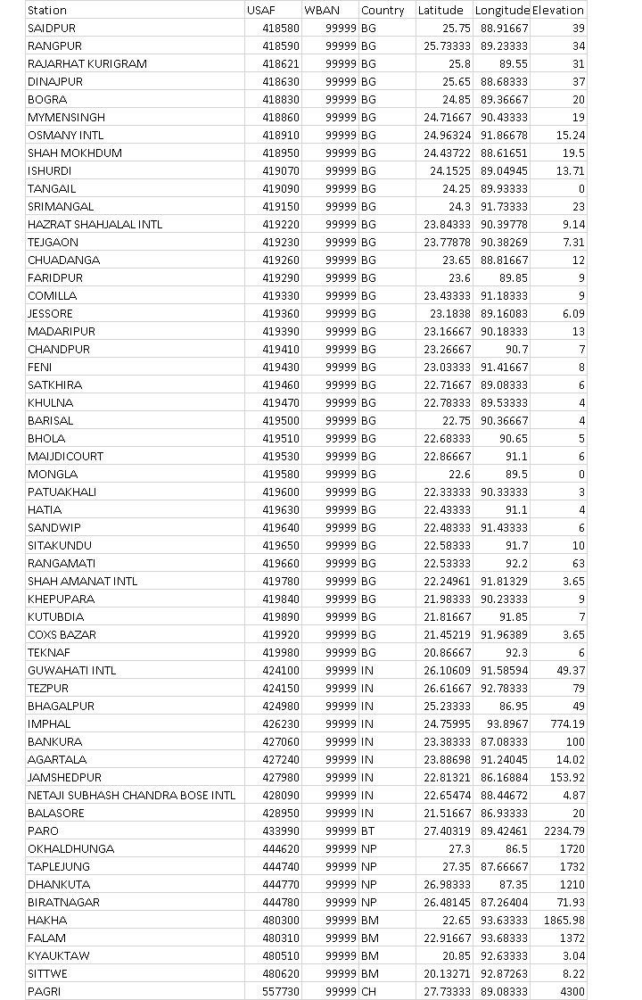

GEOBIS Weather processing
=========================
*(\\branches\\reorganize\\weather\\weather_processor.py)*

The weather processing involves a number of steps:

- Downloading weather forecast (GFS) and weather observations (GSOD)
- Processing of weather data (both GFS and GSOD)
- Uploading weather data into a MySQL database.

All steps are explained in more detail in the following sections.

Download forecasted weather (GFS weather forecast)
--------------------------------------------------
*(\\branches\\reorganize\\weather\\download_GFS_forecast.py)*

The Global Forecast System (GFS) is a weather forecast model produced by the National Centers for Environmental Prediction (NCEP). Dozens of atmospheric and land-soil variables are available through this dataset, from temperatures, winds, and precipitation to soil moisture and atmospheric ozone concentration. The entire globe is covered by the GFS at a base horizontal resolution of 18 miles (28 kilometres) between grid points.

Source GFS data: NOAA Global Forecast System @ https://www.ncdc.noaa.gov/data-access/model-data/model-datasets/global-forcast-system-gfs

The GFS data is downloaded from @ http://nomads.ncep.noaa.gov:9090/dods/gfs_0p25/

Screen shot of the download site:

GFS (gfs_0p25_00z, the first forecast of the day) is downloaded daily early in the morning (at ????).

The data file contains 3-hourly 0.25 degrees (~25km) 10-day GFS weather forecast data for the whole globe. Here only the subset Bangladesh is downloaded.

The weather forecast contains 10 days, including:

- Today: d0 (“day zero”)
- Tomorrow: d1 (“day + 1”)

  ...: d9

Bounding Box Bangladesh: latitude, longitude = [20.0, 28.0], [87.0, 94.0] degrees *(\\branches\\reorganize\\config\\__init__.py)*.

The following weather variables are downloaded:

-	Wind speed @ 10m:

	*	ugrd10m, 10m above ground u-component of wind [m/s]
	*	vgrd10m, 10m above ground v-component of wind [m/s]
	Wind speed is calculated as follows: Wind speed = SQRT(ugrd10m^2 + vgrd10m^2) [m/s]
	
-	Temperature @ 2m:

	*	tmp2m, 2m above ground air temperature [degrees Kelvin]
	*	tmax2m, 2m above ground maximum air temperature [degrees Kelvin]
	*	tmin2m, 2m above ground minimum air temperature [degrees Kelvin]

-	Humidity @ 2m:

	*	dpt2m, 2m above ground dew point temperature [degrees Kelvin]
	*	spfh2m, 2m above ground specific humidity [kg/kg]

-	Surface Solar Radiation:

	*	dswrfsfc, surface downward short-wave radiation flux [J/s/m^2]

-	Air Pressure:

	*	pressfc, surface air pressure [Pa]

-	Rainfall:

	*	apcpsfc, surface total precipitation [kg/m^2]

-	Snow depth:

	*	snodsfc, surface snow depth [m]

The folder containing daily GFS downloads (as NetCDF files): *\\branches\\reorganize\\cache\\GFS_3hrly_downloads\\*

Typical file size is 2.5Mb per day.

File format NetCDF files: *GFS_10_day_3hr_forecast_%Y%m%d.nc* (*\\branches\\reorganize\\weather\\weather.py*)

Processing GFS weather forecast data
------------------------------------
*(\\branches\\reorganize\\weather\\weather.py\\process_GFS_forecast.py)*

The GFS processing steps include:

1. Convert 3-hourly GFS data to daily mean, maximum, minimum or total values:
	a. Temperature (mean, max, min, dew point): degrees Kelvin to degrees Celsius

In order to have grid specific weather data at 5km resolution for whole Bangladesh, the GFS weather data is downscaled as follows:

2. Downscale 0.25 degrees (25km) to 0.05 degrees (5km) using:
	a. Lapse rate correction for temperature (mean, max, min and dew point). 
	
	   The lapse rate is derived from the temperature data and a Digital Elevation Map (DEM). DEM file is available in *\\branches\\reorganize\\weather\\gfs_0p25\\Calibration_coef_GFS\\*.
	
	b. Cubic convolution (a re sampling method applied to all variables, where the calculation of the new pixel value is performed by weighting the 16 surrounding pixels).
	
To correct for any (linear and seasonal) biases between the GFS data and observations a grid-specific downscaling method is applied:

3. Correct GFS data towards GSOD data using:
	a. Linear correction for temperature (mean, max, min and dew point)
	b. Seasonal correction using sinusoidal time function for temperature (mean, max, min and dew point)
	
	The linear equation is as follows:

		Y_corr i,j = (alpha i,j * Y_gfs i,j + beta i,j) + [T i,j]
		
		in which Y_gfs is the GFS interpolated parameter (e.g. temperature) for grid box [i,j]. Y_cor is the GFS interpolated and corrected parameter for grid box [i,j] and alpha and beta are grid specific correction coefficients (slope and intercept). The additional parameter [T i,j] accounts for an additional seasonal correction and reads:

		T i,j = j_1 i,j * T1 + j_2 i,j * T2 + j_3 i,j * T3 + j_4 i,j * T4

		T1 = 100 * sin(2 * pi * (doy-21) / 365)
		
		T2 = 100 * sin(2 * pi * (doy-81) / 365)
		
		T3 = 100 * sin(2 * pi * (doy-111) / 365)
		
		T4 = 100 * sin(2 * pi * (doy-141) / 365)

	c. Linear correction for wind speed at 10m
	
		U10_ds = U10_ds * 0.25

	d. Correction for rainfall
	
		Rain_GFS = IF(Rain_GFS < 10, 0, Rain_GFS * 0.55)

4. ET calculations for water (E0), moist bare soil (ES0) and crop canopy (Penman (ET0) + Penman-Monteith (ETREF))

Example of the observed bias for (average, maximum and minimum) temperature and dew point temperature between GFS and observations (GSOD) for Rangpur station:

Example of the corrected bias for (average, maximum and minimum) temperature and dew point temperature between GFS and observations for Rangpur station:

Example of raw GFS mid-day air temperature (degrees Kelvin) for Bangladesh (25km spatial resolution):

Example of downscaled and corrected GFS daily mean air temperature for Bangladesh (5km spatial resolution):

The grid specific coefficients (linear and seasonal correction), based on GFS 1.0 degrees and GSOD data for the period 2006-2012, are stored in: *\\branches\\reorganize\\weather\\gfs_0p25\\Calibration_coef_GFS\\Calibration_coef_GFSCalibration_coef_GFS_25km_2006_2012_UTC_final.nc*

Folder containing daily processed GFS data (as NetCDF-files): *\\?????????????????????????????\\*

**Quality GFS data**

First of all it must be noted that the conclusions listed below are based on GSOD. Although GSOD is freely available, it’s difficult not knowing when the data can be trusted, and therefore should be used with care.

- The GFS air temperature shows a seasonal bias with the GSOD data for both the daily mean, maximum and minimum air temperature.
- The GFS dew point temperature shows a significant bias with GSOD. The GFS model tends to be too dry (RH never reaches humidity levels of 90 – 100%) in the surface boundary layer, particularly in the winter season. As a result it is difficult to use GFS data for humidity-related weather alerts. With the grid specific downscaling it’s slightly improved. The underestimation of RH has impact on the weather alerts, i.e. the FOG and Humidity alerts.
- GFS has the tendency to overestimate the GSOD - wind speed. For now a linear correction is applied: U10_ds = U10_ds * 0.25. However, it must be noted here that GSOD – wind speed is unreliable. First comparison with wind speed data from BMD indicates that GSOD underestimates the wind speed.
- GFS has the tendency to overestimate both the rainfall amount and events from GSOD. For now the following corrections have been implemented:

	* Daily totals of less than 10mm per day are completely removed.
	* Daily totals of more than 10mm are reduced: rain_ds = rain_ds * 0.55

Suggestions for further improvements:

- Rainfall forecast can likely be improved using the Global Ensemble Forecast System (GEFS), which is an ensemble based forecast based on 21 separate forecasts (or ensemble members), which allows to get a better insight into the uncertainty of the forecast and the corresponding weather variables.
- Investigate the possibility of using a weather forecast (and weather station data) from Bangladesh Meteorological Department (BMD).

Downloading observed weather (GSOD weather station) data
--------------------------------------------------------
*(\\branches\\reorganize\\weather\\download_GSOD_data.py)*

Source GSOD @ https://www.datarefuge.org/dataset/global-summary-of-the-day-gsod

Global Surface Summary of the Day (GSOD) is derived from The Integrated Surface Hourly (ISH) dataset. The ISH dataset includes global data obtained from the USAF Climatology Center, located in the Federal Climate Complex with NCDC. The latest daily summary data are normally available 1-2 days after the date-time of the observations used in the daily summaries. The online data files begin with 1929 and are at the time of this writing at the Version 8 software level. Over 9000 stations' data are typically available.

Overview of GSOD weather stations in Bangladesh and neighbouring countries:

List of GSOD stations which are downloaded on a daily basis (source: *\\branches\reorganize\weather\\station_latlon_dem_info.csv*):

Source @ ftp://ftp.ncdc.noaa.gov/pub/data/noaa/isd-history.txt

Most stations are located in Bangladesh (36), followed by a number of stations (19) from neighbouring countries (e.g. India and Nepal).

The folder containing daily GSOD downloads (compressed zip files): *\\branches\\reorganize\\cache\\GSOD_downloads\\*

Typical file size is ~7kb per day per station.

Process GSOD weather station data
---------------------------------
*(\\branches\\reorganize\\weather\\process_GSOD_data.py)*

The processing of the GSOD weather station data includes:

1. Conversion of units:
	a. Temperature: degrees Fahrenheit to degrees Celsius
	b. Rain & Snow: inch to mm
	c. Visibility: miles to km
	d. Wind speed: knots to meters per second

2. Quality check data (remove NaN-values).

3. Interpolate a raster surface (5km resolution) from points (weather stations) using:
	a. An inverse distance weighted (IDW) technique (for all variables)
	b. Lapse rate correction for temperature (mean, max, min and dew point)
	
	   (Lapse rate is derived from temperature data and elevation map (DEM))
	
4. Derive relative humidity (RH) from air temperature and dew point data.

5. Derive solar radiation from daily maximum and minimum air temperature using Hargreaves method (coefficients are taken from: *Calibration_coef_GFS_25km_2006_2012_UTC_final.nc*).

6. ET calculations for water (E0), moist bare soil (ES0) and crop canopy (Penman (ET0) + Penman-Monteith (ETREF)).

7. Fill missing days with Long Term Average (LTA) archive.

LTA archive: *????????????????????????????????????????*

Folder LTA archive (NetCDF file): *\\?????????????????????????????????????????\\*

Folder containing daily processed GSOD data: *\\?????????????????????????????????????????\\*

**Quality GSOD data**

GSOD weather data is an important recourse and is freely available. However, ...

- The dataset is a derived dataset that is computed from archived daily & sub-daily reported data on the global telecommunications system (and other sources) and archived by NOAA. Daily observations are estimated based on what is known about a given day. For example, daily rain may consist of one 24 hour report, or the sum of 12 hour reports or the sum of available 6 hour reports. Likewise, daily temperatures will be based on available hourly reports.
- The underlying data is frequently incomplete, and in that case can only be a ‘best estimate’
- The data used may have been misreported in the original synoptic report
- Sometimes the reported data is archived incorrectly before being processed into the GSOD archive
- Which means that it’s difficult not knowing when the data can be trusted.

Suggestions for further improvements:

- Replace GSOD and LTA-archive (based on GSOD) by weather data from national office (BMD). Important criteria is that the BMD data can be downloaded daily in a standard format (which is not the case right now).

Loading GFS and GSOD weather data in MySQL database
---------------------------------------------------
*(\\branches\\reorganize\\database\\update_gridweatherdb.py)*

Once the weather data (GFS and GSOD) have been downloaded and processed, they are loaded into the MySQL weather database, so they are available for the GEOBIS crop model.

Folder structure and data files weather data processing
-------------------------------------------------------

Main folders containing python scripts and data files for weather data processing:

- *\\branches\\reorganize\\weather\\*

- *\\branches\\reorganize\\database\\*

- *\\branches\\reorganize\\cache\\GFS_3hrly_downloads\\*

- *\\branches\\reorganize\\cache\\GSOD_downloads\\*